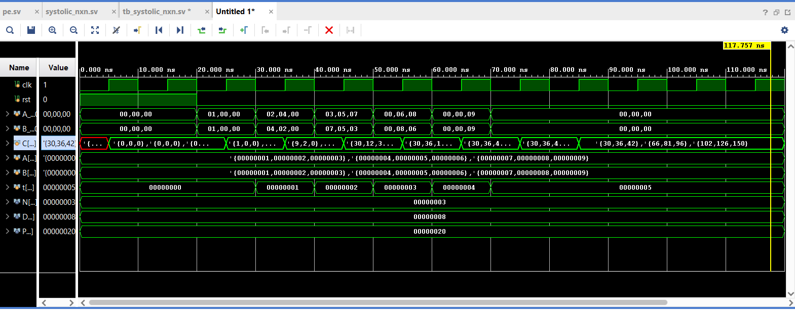

# NxN Systolic Array for Matrix Multiplication (SystemVerilog)

This project implements a **parameterized NxN systolic array** for matrix multiplication using **SystemVerilog RTL**.  
It demonstrates scalable hardware design using processing elements (PEs), generate constructs, and correct systolic dataflow with **temporal input skewing**.

The design generalizes a basic 2×2 systolic array to arbitrary matrix sizes, similar in principle to modern hardware accelerators (e.g., TPU-style architectures).

---

## Architecture Overview

- Fully parameterized **NxN systolic array**
- Each Processing Element (PE) performs:
  - Multiply–Accumulate (MAC)
  - Internal partial sum storage
- Matrix **A flows horizontally**
- Matrix **B flows vertically**
- Correct **cycle-level skewing** ensures proper systolic operation
- Written in **SystemVerilog (RTL subset)**

---

## Project Structure

rtl/ → RTL modules
- pe.sv (Processing Element)
- systolic_nxn.sv (NxN systolic array)

testbench/ → Testbench
- tb_systolic_nxn.sv

simulation/ → Simulation waveforms

---

## RTL Modules

### `pe.sv`
- Implements a Processing Element (PE)
- Internal accumulator for partial sums
- Registered propagation of A and B values
- Fully reusable across all array sizes

### `systolic_nxn.sv`
- Parameterized top-level systolic array
- Uses `generate` loops to instantiate an NxN grid of PEs
- Handles spatial dataflow (A → right, B → down)

---

## Verification Methodology

- Verified using **SystemVerilog testbench**
- Testbench applies **cycle-accurate temporal skewing** of inputs
- Multiple test cases validated:
  - 3×3 matrix multiplication
  - 4×4 matrix multiplication
  - Identity and custom matrices

The RTL design remains unchanged across all tests.

---

## Example Verification Result (3×3)

For:

A = B =
{1 2 3
4 5 6
7 8 9}

Result:

{30 36 42
66 81 96
102 126 150}

Simulation results match expected matrix multiplication outputs.

---

## Key Concepts Demonstrated

- Systolic array dataflow
- Temporal skewing of inputs
- Parameterized RTL design
- Generate-based hardware scalability
- Separation of design and verification

---

## Future Enhancements

- Move input skewing logic into RTL
- Add `valid` / `done` signaling
- Latency and throughput analysis
- FPGA synthesis and optimization
- Streaming interface integration

---

## Simulation Waveform

The waveform below shows correct systolic dataflow, temporal input skewing, and stable output values after pipeline latency.

